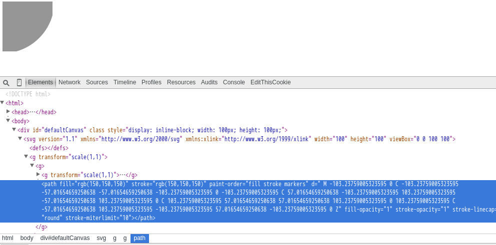

# p5.js-svg

The main goal of p5.SVG is to provide a SVG runtime for p5.js,
so that we can draw using p5's powerful API in \<svg\>, save things to svg file
and manipulating existing SVG file without rasterization.

## Getting Started

Add this line in your projects index.html :

```html
<script src="https://unpkg.com/p5.js-svg@1.1.1"></script>
```

(p5.js-svg v1.1.x is compatible with p5.js v1.4.0)

Open your sketch.js and edit it:

```javascript
function setup() {
    createCanvas(100, 100, SVG);
    background(255);
    fill(150);
    stroke(150);
}

function draw() {
    var r = frameCount % 200 * Math.sqrt(2);
    background(255);
    ellipse(0, 0, r, r);
}
```

Then you can open your html file, and view the result.
It's \<svg\>!



## Examples

- https://zenozeng.github.io/p5.js-svg/examples/
- https://zenozeng.github.io/p5.js-svg/test/

## SVG Renderer vs Canvas2D Renderer

The major difference is that SVG Renderer is based on SVG Document Object Model
while Canvas 2D Renderer is based on pixels.
Therefore, the performance may not be as good as canvas, but SVG-format vector images can be rendered at any size without loss of quality.

Note that not all drawing results are exactly same in pixel-level.For example, the round rects below are almost same, but there are some pixels different.


As for filters, gray(), invert(), threshold(), opaque() did have same behavior as Canvas2D Renderer. But blur(), erode(), dilate() didn't.

To implement blur, feGaussianBlur was used, which is different from Processing's blur.


As for erode() and dilate(), they were implemnted using feOffset and feBlend. So, the result is not exactly same.


You can view all the pixels based diff on the [online tests](http://zenozeng.github.io/p5.js-svg/test/).

## Browser Compatibility

p5.js-svg@1.x was tested and should work on:

- Chromium 90 (Debian 11.0, LXQt 0.16)
- Safari (iPadOS 14)

## How it works

p5.RendererSVG is a class which extends p5.Renderer2D.
A mocked \<canvas\> element and a CanvasRenderingContext2D api are provided using [svgcanvas](https://github.com/zenozeng/svgcanvas),
which is JavaScript Object that syncs proprieties and draws on \<svg\> element.

## Known issue

### Too many child elements

Since SVG is XML-based, every call of the draw function will insert elements into it, and these elements keep existing even if they are not visible. So, long-time running will result in too many child elements. We recommend calling clear() in your draw function, which will trigger internal context.__clearCanvas() to remove elements.

```javascript
function draw() {
    clear();
    // draw
}
```

See https://github.com/zenozeng/p5.js-svg/issues/32

### blendMode is not implemented yet.

## Building dist

To build dist files after cloning repo, you can run:

```bash
npm install
npm run build
```

## Tests

p5.SVG was driven by tests.
We use Karma and mocha.
Most tests are based on pixel-diff.
There are still some p5's methods not covered with unit tests.
But Rendering and Shape API are already covered with tests and should work.

If you found a bug, feel free to open a issue or pull a request.

All tests can be found here:
https://github.com/zenozeng/p5.js-svg/tree/master/test/unit

You can also run the online test yourself:
https://zenozeng.github.io/p5.js-svg/test/

And this is our coverage report:
https://coveralls.io/github/zenozeng/p5.js-svg?branch=master
