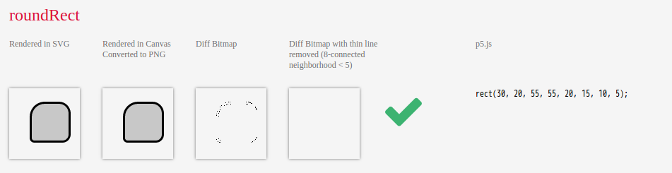
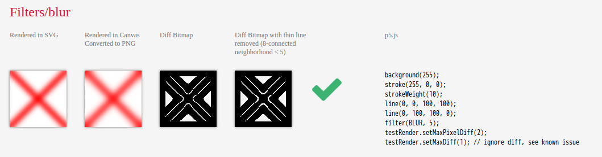
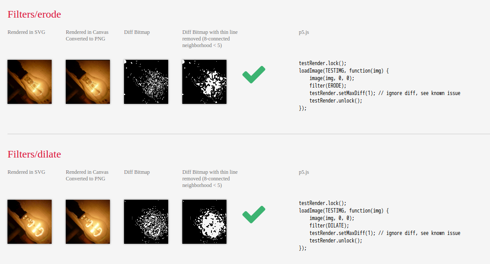

# p5.SVG Overview

The main goal of p5.SVG is to provide a SVG runtime for p5.js,
so that we can draw using p5's powerful API in \<svg\>, save things to svg file
and manipulating existing SVG file without rasterization.
I hope we can write once and run on both canvas and SVG.

p5.SVG consists of 2 parts:

- p5.RendererSVG

    Allow drawing using p5.js API on top of a \<svg\> element.

- SVGElement API

    It's a class extending p5.Element, but provides more API for manipulating SVG.

## So, how is SVG Renderer different than Canvas2D Renderer

The major difference is that SVG Renderer is based on SVG Document Object Model
while Canvas 2D Renderer is based on pixels.
Therefore, the performance may not be as good as canvas.
However, being DOM-based also means that it is possible to modify what's already drawn without drawing new elements. This can be done using the SVGElement API.

Note that not all drawing results are exactly same in pixel-level.

For example, the round rects below are almost same, but there are some pixels different.

As for filters, gray(), invert(), threshold(), opaque() did have same behavior as Canvas2D Renderer. But blur(), erode(), dilate() didn't.

To implement blur, I use feGaussianBlur, which is different from Processing's blur.

As for erode() and dilate(), they were implemnted using feOffset and feBlend. So, the result is not exactly same.

You can view all the pixels based diff on the [online tests](http://zenozeng.github.io/p5.js-svg/test/).

## SVGElement API

SVGElement is a class extending p5.Element, but provides more API for manipulating SVG.
It provides:

- SVGElement.prototype.query (querySelectorAll and map to SVGElement objects)

- SVGElement.prototype.attribute (setAttributeNS, setAttribute and getAttribute)

- SVGElement.prototype.append

- SVGElement.create = function(nodeName, attributes)

- SVGElement.prototype.parentNode()

    Get parent node

- SVGElement.prototype.parentNode(selector)

    Get parent node matching given selector

- SVGElement.prototype.matches = function(selector)

    To tell whether a element matches certain selector

- SVGElement.prototype.filter

    Apply filter (blur, gray, threshold, invert, opaque, posterize, erode, dilate, colorMatrix) on given SVG object.
    If called multiple times, these filters will be chained together and combine to a bigger SVG filter.

- SVGElement.prototype.unfilter

    Unapply any filter applied on given SVG object.
    After called, rest filters will be chained together and combine to a new SVG filter.

## Getting Started

See [Getting Started with p5.SVG](./getting-started.md).

## Browser Compatibility

p5.SVG@0.4.2 was tested and should work on:

- Firefox 40.0 on Linux

- Google Chrome 44 on Linux

- Google Chrome 43 on Android 4.4.4

- Safari 8.0.7 on Mac (Thanks @fnlctrl)

- Safari on iOS 8 (Thanks @chiyolyn)

p5.SVG@0.4.2 may not work on IE10. There are still [some issues](https://github.com/zenozeng/p5.js-svg/issues/122).

As for Microsoft Edge, p5.SVG@0.4.2 basically works, but there are [issues with Filters/posterize and Filters/erode](https://github.com/zenozeng/p5.js-svg/issues/128).

## How it works

p5.RendererSVG is a class which extends p5.Renderer2D.
I create a mock \<canvas\> element,
which is JavaScript Object that syncs proprieties to \<svg\>.
A drawing context is provided,
it provides most canvas's API but will draw them on \<svg\> element.

I created [svgcanvas](https://github.com/zenozeng/svgcanvas) for this.
It is based on [gliffy's canvas2svg](https://github.com/gliffy/canvas2svg) with [patches](https://github.com/gliffy/canvas2svg/issues?utf8=%E2%9C%93&q=author%3Azenozeng+), plus some methods for mocking \<canvas\> element.

Note that due to the performance issue, I also implement a basic GC (with generations mark) when ctx.background and clear called.

## Known issue

- blendMode is not implemented yet.

- [P3D is not supported yet](https://github.com/zenozeng/p5.js-svg/issues/51)

## Tests

p5.SVG was driven by tests.
We use Karma and mocha.
Most tests are based on pixel-diff.
There are still some p5's methods not covered with unit tests.
But Rendering and Shape API are already covered with tests and should work.

If you found a bug, feel free to open a issue or pull a request.

All tests can be found here:
https://github.com/zenozeng/p5.js-svg/tree/master/test/unit

You can also run the online test yourself:
http://zenozeng.github.io/p5.js-svg/test/

And this is our coverage report:
https://coveralls.io/github/zenozeng/p5.js-svg?branch=master
